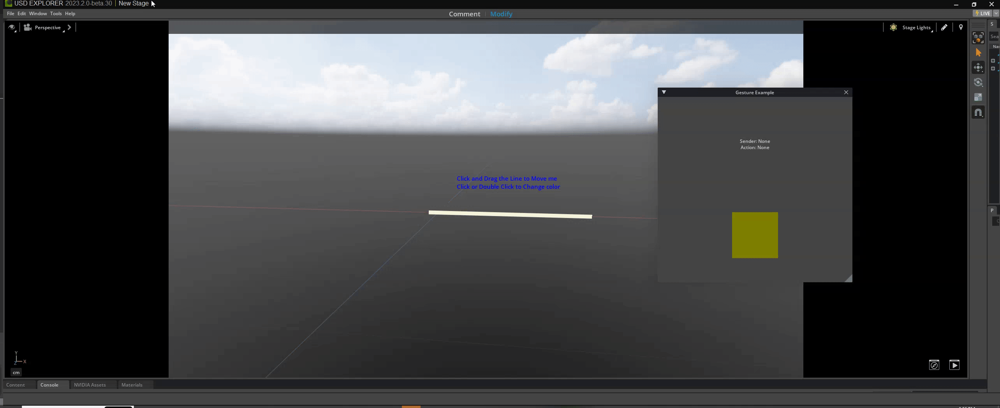
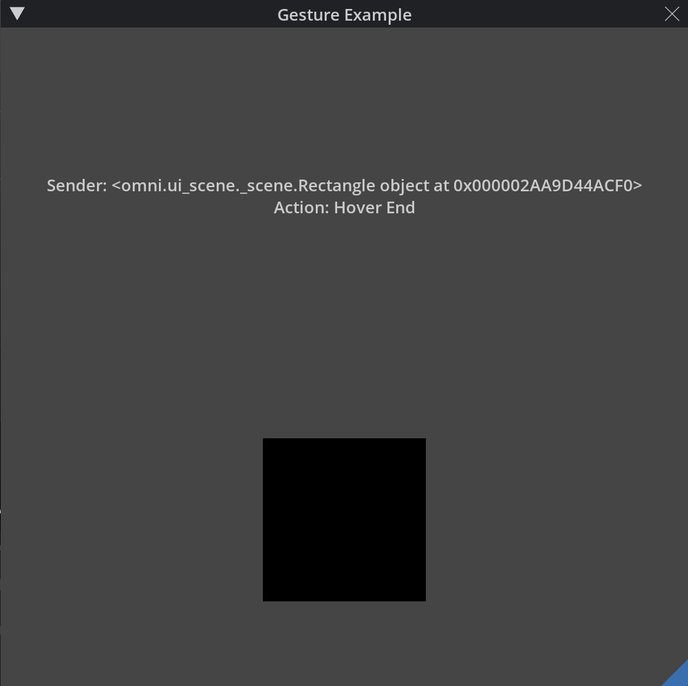
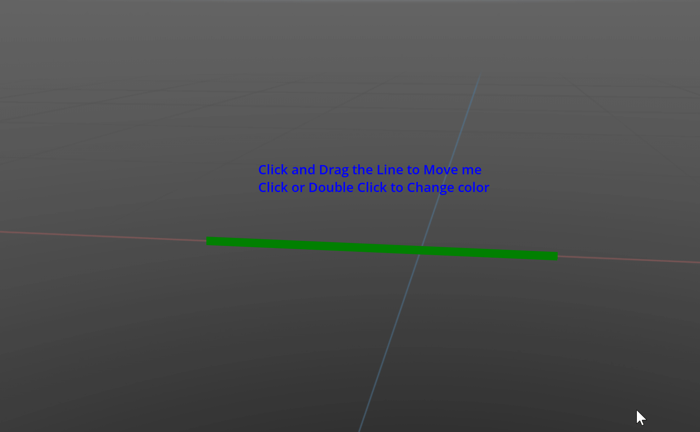

# UI Gestures Extension Sample



## [UI Gestures for omni.ui (omni.example.gesture_window)](exts/omni.example.gesture_window)



### About
This extension shows how to create gestures using omni.ui. The focus of this sample extension is to show how to register and create a scene view within a Window.


### [README](exts/omni.example.gesture_window)
See the [README for this extension](exts/omni.example.gesture_window) to learn more about it including how to use it.

## [UI Gestures for Viewport (omni.example.gesture_viewport)](exts/omni.example.gesture_viewport)



### About
This extension shows how to create a simple manipulator with gestures using omni.ui.scene. The focus of this sample extension is to show how to create a simple manipulator and register gestures in the viewport.


### [README](exts/omni.example.gesture_viewport)
See the [README for this extension](exts/omni.example.gesture_viewport) to learn more about it including how to use it.

## [Tutorial](docs/tutorial.md)
Follow a [step-by-step tutorial](exts/docs/tutorial.md) that walks you through how to use omni.ui.scene to build this extension.

## Adding This Extension

To add a this extension to your Omniverse app:
1. Go into: Extension Manager -> Hamburger Icon -> Settings -> Extension Search Path
2. Add this as a search path: `git://github.com/NVIDIA-Omniverse/kit-extension-sample-gestures.git?branch=main&dir=exts`

Alternatively:
1. Download or Clone the extension, unzip the file if downloaded
2. Copy the `exts` folder path within the extension folder
    - i.e. home/.../kit-extension-sample-gestures/exts (Linux) or C:/.../kit-extension-sample-gestures/exts (Windows)
3. Go into: Extension Manager -> Hamburger Icon -> Settings -> Extension Search Path
4. Add the `exts` folder path as a search path

## Linking with an Omniverse app

For a better developer experience, it is recommended to create a folder link named `app` to the *Omniverse Kit* app installed from *Omniverse Launcher*. A convenience script to use is included.

Run:

```bash
# Windows
> link_app.bat
```

```shell
# Linux
~$ ./link_app.sh
```

If successful you should see `app` folder link in the root of this repo.

If multiple Omniverse apps are installed the script will select the recommended one. Or you can explicitly pass an app:

```bash
# Windows
> link_app.bat --app code
```

```shell
# Linux
~$ ./link_app.sh --app code
```

You can also pass a path that leads to the Omniverse package folder to create the link:

```bash
# Windows
> link_app.bat --path "C:/Users/bob/AppData/Local/ov/pkg/create-2022.1.3"
```

```shell
# Linux
~$ ./link_app.sh --path "home/bob/.local/share/ov/pkg/create-2022.1.3"
```

## Contributing
The source code for this repository is provided as-is and we are not accepting outside contributions.