# How to make an extension with UI Gestures in a UI Window and the Viewport

The Gestures extensions show the basics of how gestures work in Omniverse and how users can start creating their own scene manipulators. This guide is great for extension builders who want to start creating their own scene manipulator tools in Omniverse.

  > NOTE: Visual Studio Code is the preferred IDE, hence forth we will be referring to it throughout this guide. 
  > NOTE: Omniverse Code is the preferred platform, hence forth we will be referring to it throughout this guide.

# Learning Objectives

In this tutorial you learn how to:
- How to create/register a scene view
- Use the omni.ui.scene API
- How to use Gestures
- What Gesture States are
- Prioritizing Gestures
- Creating a Gesture Manager

# Prerequisites
  We recommend that you complete these tutorials before moving forward:

- [Extension Environment Tutorial](https://github.com/NVIDIA-Omniverse/ExtensionEnvironmentTutorial)
- [How to make an extension by spawning prims](https://github.com/NVIDIA-Omniverse/kit-extension-sample-spawn-prims)


# Step 1: Create an Extension

> **Note:** This is a review, if you know how to create an extension, feel free to skip this step.

For this guide, we will briefly go over how to create an extension. If you have not completed [How to make an extension by spawning prims](https://github.com/NVIDIA-Omniverse/kit-extension-sample-spawn-prims/blob/main/exts/omni.example.spawn_prims/tutorial/tutorial.md) we recommend you pause here and complete that before moving forward.

## Step 1.1: Create the extension template

  In Omniverse Code navigate to the `Extensions` tab and create a new extension by clicking the ➕ icon in the upper left corner and select `New Extension Template Project`. 

Name the project to `kit-ext-gestures` and the extension name to `my.gestures.window`.

  

> **Note:** If you don't see the *Extensions* Window, enable **Window > Extensions**:
>
> 
  

<icon>                       |  <new template>
:-------------------------:|:-------------------------:
  |  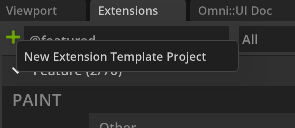

A new extension template window and Visual Studio Code will open after you have selected the folder location, folder name, and extension ID. 

## Step 1.2: Naming your extension

  Before beginning to code, navigate into `VS Code` and change how the extension is viewed in the **Extension Manager**. It's important to give your extension a title and description for the end user to understand the extension's purpose. 

Inside of the `config` folder, locate the `extension.toml` file.

> **Note:** `extension.toml` is located inside of the `exts` folder you created for your extension.  


Inside of this file, there is a title and description for how the extension will look in the **Extension Manager**. Change the title and description for the extension. 

``` python
title = "Gesture Window"
description="Example on how Gestures work in omni.ui"
```

# Step 2: Create `omni.ui` Window

## Step 2.1: Create `window.py`

In VS Code, **create** a file called `window.py` in `exts/my.gestures.window/my/gestures/window/`..

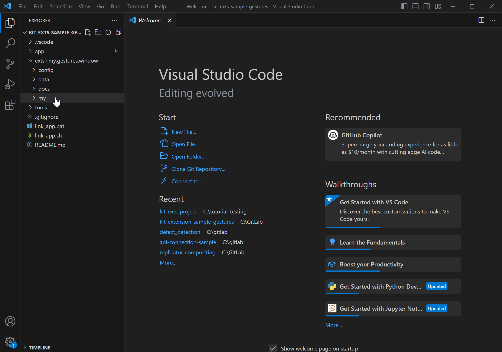

This file will hold our logic for creating an `omni.ui` Window

## Step 2.2: Set Up UI Window Class

With `window.py` created, **add** the following code block inside:

``` python
import omni.ui as ui

# Inherits from omni.ui.Window 
class GestureWindowExample(ui.Window):
    def __init__(self, title: str, **kwargs) -> None:
        super().__init__(title, **kwargs)
        # Sets the build function so when the frame refreshes / rebuilds it will run the corresponding function
        self.frame.set_build_fn(self._build_fn)

    # Build function for our Window
    def _build_fn(self):
        with self.frame:
            with ui.VStack():
                ui.Label("Hello World")
```

**Save** `window.py`.

This only sets up our Window class. To have the window created we will head into `extension.py`.

## Step 2.3: Create the UI Window

Open `extension.py` and **replace** all of the code inside with the following:

```python
import omni.ext
from .window import GestureWindowExample


# Any class derived from `omni.ext.IExt` in top level module (defined in `python.modules` of `extension.toml`) will be
# instantiated when extension gets enabled and `on_startup(ext_id)` will be called. Later when extension gets disabled
# on_shutdown() is called.
class OmniExampleGestureExtension(omni.ext.IExt):
    # ext_id is current extension id. It can be used with extension manager to query additional information, like where
    # this extension is located on filesystem.
    def on_startup(self, ext_id):
        print("[omni.example.gesture] omni example gesture startup")
        self._window = GestureWindowExample("Gesture Example", width=500, height=500)


    def on_shutdown(self):
        print("[omni.example.gesture] omni example gesture shutdown")
        if self._window:
            self._window.destroy()
        self._window = None
```

**Save** `extension.py` and **go back** to Omniverse and your window should look like the following:

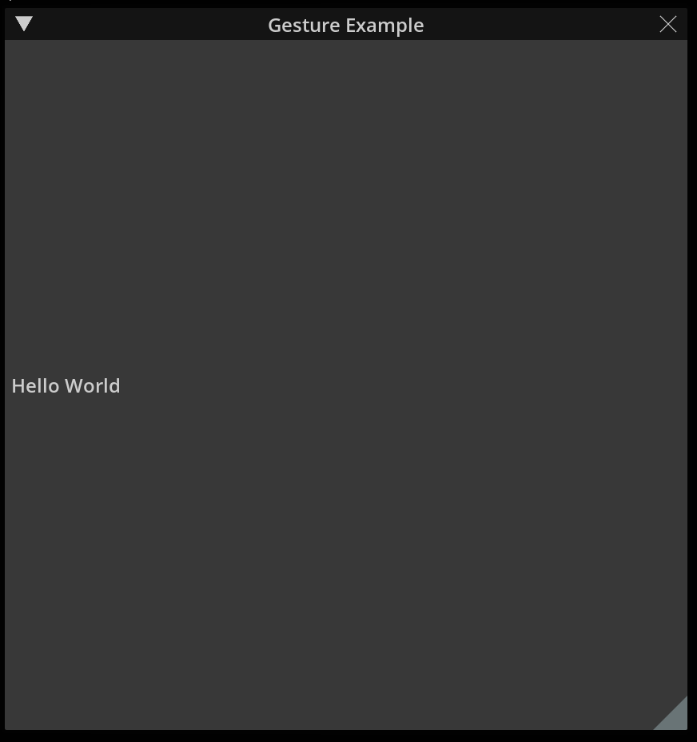

So far we have created a UI Window that can be docked or dragged within Omniverse.

# Step 3: Create a SceneView

[SceneUI](https://docs.omniverse.nvidia.com/kit/docs/omni.ui.scene/latest/Scene.html) helps build 3D manipulators and 3D helpers. It provides shapes and controls for declaring the UI in 3D Space.

## Step 3.1: Import scene tools

**Go back** to VS Code and **open** `window.py`.

In order to use the Scene API **add** the following line under `import omni.ui as ui`:

```python
from omni.ui import scene as sc
```

After adding your code will read:

```python
import omni.ui as ui
from omni.ui import scene as sc
```

## Step 3.2: Create SceneView and Project in the Window

1. **Create** the projection matrix, this will indicate the position of the camera for our scene in the UI. **Add** the following code under `from omni.ui import scene as sc` but before `class GestureWindowExample(ui.Window)`:

```python
proj = [0.5,0,0,0,0,0.5,0,0,0,0,2e-7,0,0,0,1,1]
```

2. **Remove** `ui.Label("Hello World")` and **replace it** with the following:

```python
scene_view = sc.SceneView(sc.CameraModel(proj, 1), aspect_ratio_policy=sc.AspectRatioPolicy.PRESERVE_ASPECT_FIT)
```

Saving `window.py` now will result in an empty UI window. With the scene established other UI elements can now be populated inside.

## Step 3.3: Add a Rectangle

To add a rectangle to the Scene add the following under where `scene_view` was declared:

```python
with scene_view.scene:
    transform = sc.Transform()
    with transform:
        sc.Rectangle(
            2, # width
            2, # height
            color = ui.color.beige,
            thickness=5
        )
```

After editing `window.py` should look like the following:

```python
import omni.ui as ui
from omni.ui import scene as sc

proj = [0.5,0,0,0,0,0.5,0,0,0,0,2e-7,0,0,0,1,1]

class GestureWindowExample(ui.Window):
    def __init__(self, title: str, **kwargs) -> None:
        super().__init__(title, **kwargs)
        self.frame.set_build_fn(self._build_fn)

    def _build_fn(self):
        with self.frame:
            with ui.VStack():
                scene_view = sc.SceneView(sc.CameraModel(proj, 1), aspect_ratio_policy=sc.AspectRatioPolicy.PRESERVE_ASPECT_FIT)
                with scene_view.scene:
                    transform = sc.Transform()
                    with transform:
                        sc.Rectangle(
                            2,
                            2,
                            color=ui.color.beige,
                            thickness=5
                        )
```

**Save** `window.py` and go back to Omniverse. You will see that our window now has a beige square.

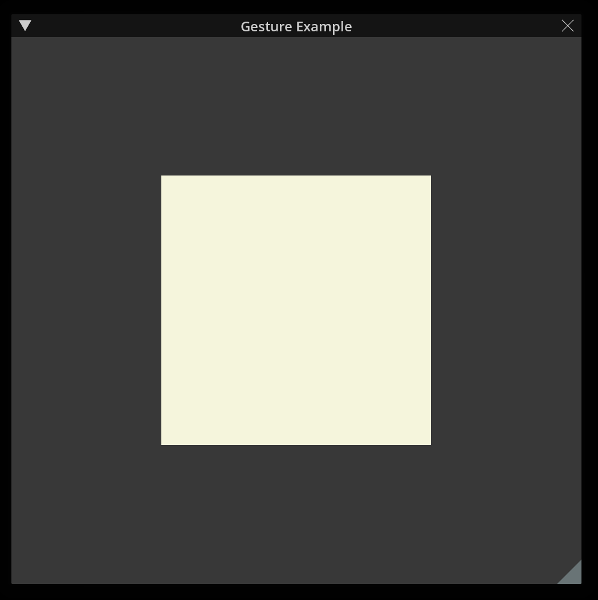

# Step 4: Add a Gesture

Currently, the square does nothing. No actions will occur when hovering, dragging, or clicking on it. To add actions we will be adding [Gestures](https://docs.omniverse.nvidia.com/kit/docs/omni.ui.scene/latest/Gestures.html).

## Step 4.1 Create `setcolor()` 

In `window.py`, under `proj=[...]` **add** the following lines after:

```python
def setcolor(sender, color):
    sender.color = color
```

This function will be used to change the color of the shape.

## Step 4.2: Add Gesture Callback

**Add** a comma after `thickness=5` then **add** the following line after:

```python
gesture=sc.ClickGesture(lambda s: setcolor(s, ui.color.blue))
```


After editing `window.py` should look like the following:

```python
import omni.ui as ui
from omni.ui import scene as sc

proj = [0.5,0,0,0,0,0.5,0,0,0,0,2e-7,0,0,0,1,1]

def setcolor(sender, color):
    sender.color = color

class GestureWindowExample(ui.Window):
    def __init__(self, title: str, **kwargs) -> None:
        super().__init__(title, **kwargs)
        self.frame.set_build_fn(self._build_fn)

    def _build_fn(self):
        with self.frame:
            with ui.VStack():
                scene_view = sc.SceneView(sc.CameraModel(proj, 1), aspect_ratio_policy=sc.AspectRatioPolicy.PRESERVE_ASPECT_FIT)
                with scene_view.scene:
                    transform = sc.Transform()
                    with transform:
                        sc.Rectangle(
                            2,
                            2,
                            color=ui.color.beige,
                            thickness=5,
                            gesture=sc.ClickGesture(lambda s: setcolor(s, ui.color.blue))
                        )
```

**Save** `window.py` and go back to Omniverse. When you click on the Rectangle now it should change from beige to blue.

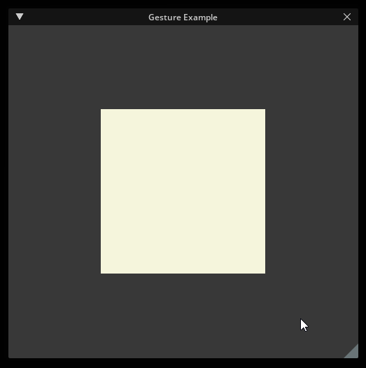

## Step 4.3: Gesture States

Some Gestures have different states. To show how the different states work **change** the gesture for the Rectangle to the following:

```python
sc.Rectangle(
    2,
    2,
    color=ui.color.beige,
    thickness=5,
    gesture=
        sc.DragGesture(
            on_began_fn=lambda s: setcolor(s, ui.color.indigo),
            on_changed_fn=lambda s: setcolor(s, ui.color.lightblue),
            on_ended_fn=lambda s: setcolor(s, ui.color.beige)
            )
)

```

After editing `window.py` should look like the following:

```python
import omni.ui as ui
from omni.ui import scene as sc

proj = [0.5,0,0,0,0,0.5,0,0,0,0,2e-7,0,0,0,1,1]

def setcolor(sender, color):
    sender.color = color

class GestureWindowExample(ui.Window):
    def __init__(self, title: str, **kwargs) -> None:
        super().__init__(title, **kwargs)
        self.frame.set_build_fn(self._build_fn)

    def _build_fn(self):
        with self.frame:
            with ui.VStack():
                scene_view = sc.SceneView(sc.CameraModel(proj, 1), aspect_ratio_policy=sc.AspectRatioPolicy.PRESERVE_ASPECT_FIT)
                with scene_view.scene:
                    transform = sc.Transform()
                    with transform:
                        sc.Rectangle(
                            2,
                            2,
                            color=ui.color.beige,
                            thickness=5,
                            gesture=
                                sc.DragGesture(
                                    on_began_fn=lambda s: setcolor(s, ui.color.indigo),
                                    on_changed_fn=lambda s: setcolor(s, ui.color.lightblue),
                                    on_ended_fn=lambda s: setcolor(s, ui.color.beige)
                                    )
                        )
```

**Save** `window.py` and go back to Omniverse. Click on the Rectangle and Click and Drag. Notice how it changes colors based on what was set for each function.

- `on_began_fn` occurs when first clicking and no mouse movement occurs.
- `on_changed_fn` occurs when the gesture starts and the mouse is dragged.
- `on_ended_fn` occurs when the mouse is released.

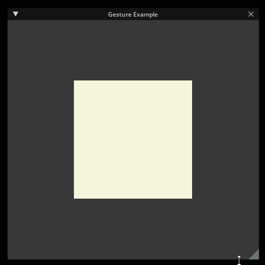


## Step 4.4: Moving by Dragging

Next we will look into how the Rectangle can move using DragGesture.

1. Back in `window.py` **add** the following function before `setcolor()`:

```python
def move(transform, shape):
    translate = shape.gesture_payload.moved
    # Move transform to the direction mouse moved
    current = sc.Matrix44.get_translation_matrix(*translate)
    transform.transform *= current
```

2. **Add** the following import at the top of the `window.py`:
- `from functools import partial`

3. **Update** DragGesture's `on_changed_fn` to look like the following:

```python
sc.DragGesture(
    on_began_fn=lambda s: setcolor(s, ui.color.indigo),
    on_changed_fn=partial(move, transform),
    on_ended_fn=lambda s: setcolor(s, ui.color.beige)
    )
```

After editing `window.py` should look like the following:

```python
import omni.ui as ui
from omni.ui import scene as sc
from functools import partial

proj = [0.5,0,0,0,0,0.5,0,0,0,0,2e-7,0,0,0,1,1]

def move(transform, shape):
    translate = shape.gesture_payload.moved
    # Move transform to the direction mouse moved
    current = sc.Matrix44.get_translation_matrix(*translate)
    transform.transform *= current

def setcolor(sender, color):
    sender.color = color

class GestureWindowExample(ui.Window):
    def __init__(self, title: str, **kwargs) -> None:
        super().__init__(title, **kwargs)
        self.frame.set_build_fn(self._build_fn)

    def _build_fn(self):
        with self.frame:
            with ui.VStack():
                scene_view = sc.SceneView(sc.CameraModel(proj, 1), aspect_ratio_policy=sc.AspectRatioPolicy.PRESERVE_ASPECT_FIT)
                with scene_view.scene:
                    transform = sc.Transform()
                    with transform:
                        sc.Rectangle(
                            2,
                            2,
                            color=ui.color.beige,
                            thickness=5
                            gesture=
                                sc.DragGesture(
                                    on_began_fn=lambda s: setcolor(s, ui.color.indigo),
                                    on_changed_fn=partial(move, transform),
                                    on_ended_fn=lambda s: setcolor(s, ui.color.beige)
                                    )
                        )
```

**Save** `window.py` and go back to Omniverse. Notice that now when the Rectangle is dragged it will now move based on the mouse's position.

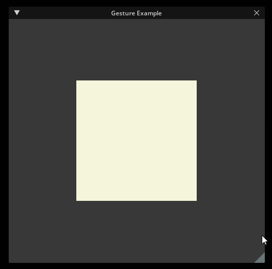

## Step 4.5: Extending `sc.DragGesture`

We can extend any gesture by reimplementing its class. 

1. In `window.py` after `proj`, **create** a new class called `Move`:
    - `class Move(sc.DragGesture):`
2. Inside of `Move` **add** the following code:
- ```python
    def __init__(self, transform: sc.Transform, **kwargs):
        super().__init__(**kwargs)
        self.__transform = transform
    ```
3. After `__init__()` **add** the following code:
- ```python
    def on_changed(self):
        translate = self.sender.gesture_payload.moved
        # Move transform to the direction mouse moved
        current = sc.Matrix44.get_translation_matrix(*translate)
        self.__transform.transform *= current
    ```

> **Note:** The above code is similar to the `move()` function. For future code references this will be **removed**.

4. **Change** the value passed to `gesture` when creating the Rectangle to `Move(transform)`
- ```python
    sc.Rectangle(
        2,
        2,
        color=ui.color.beige,
        thickness=5,
        gesture=
            Move(transform)
    )
    ```
5. **Save** `window.py`.

After editing `window.py` should look like the following:

```python
import omni.ui as ui
from omni.ui import scene as sc
from functools import partial

proj = [0.5,0,0,0,0,0.5,0,0,0,0,2e-7,0,0,0,1,1]

class Move(sc.DragGesture):
    def __init__(self, transform: sc.Transform, **kwargs):
        super().__init__(**kwargs)
        self.__transform = transform

    def on_changed(self):
        translate = self.sender.gesture_payload.moved
        # Move transform to the direction mouse moved
        current = sc.Matrix44.get_translation_matrix(*translate)
        self.__transform.transform *= current

def setcolor(sender, color):
    sender.color = color

class GestureWindowExample(ui.Window):
    def __init__(self, title: str, **kwargs) -> None:
        super().__init__(title, **kwargs)
        self.frame.set_build_fn(self._build_fn)

    def _build_fn(self):
        with self.frame:
            with ui.VStack():
                scene_view = sc.SceneView(sc.CameraModel(proj, 1), aspect_ratio_policy=sc.AspectRatioPolicy.PRESERVE_ASPECT_FIT)
                with scene_view.scene:
                    transform = sc.Transform()
                    with transform:
                        sc.Rectangle(
                            2,
                            2,
                            color=ui.color.beige,
                            thickness=5,
                            gesture=
                                Move(transform)
                        )
```

There are multiple ways that a Gesture Callback can be added.
1. Adding the Gesture Callback with a single function
2. Adding a function for each state in the Gesture Callback
3. Reimplementing Gesture 

# Step 5: Multiple Gestures and Multiple Shapes

Shapes are not limited to having one Gesture, they can have more than one. There is also no limit to how many shapes as well.

## Step 5.1: Add Multiple Gestures

In `window.py`, **update** the parameters inside Rectangle to the following:

```python
sc.Rectangle(
    2,
    2,
    color=ui.color.beige,
    thickness=5,
    gestures=[
        Move(transform),
        sc.ClickGesture(lambda s: setcolor(s, ui.color.red)),
        sc.DoubleClickGesture(lambda s: setcolor(s, ui.color.beige))
    ]
)
```

> **Note:** that instead of using `gesture`, use `gestures` and pass in a list of gestures.

After editing `window.py` should look like the following:

```python
import omni.ui as ui
from omni.ui import scene as sc
from functools import partial

proj = [0.5,0,0,0,0,0.5,0,0,0,0,2e-7,0,0,0,1,1]

class Move(sc.DragGesture):
    def __init__(self, transform: sc.Transform, **kwargs):
        super().__init__(**kwargs)
        self.__transform = transform

    def on_changed(self):
        translate = self.sender.gesture_payload.moved
        # Move transform to the direction mouse moved
        current = sc.Matrix44.get_translation_matrix(*translate)
        self.__transform.transform *= current

def setcolor(sender, color):
    sender.color = color

class GestureWindowExample(ui.Window):
    def __init__(self, title: str, **kwargs) -> None:
        super().__init__(title, **kwargs)
        self.frame.set_build_fn(self._build_fn)

    def _build_fn(self):
        with self.frame:
            with ui.VStack():
                scene_view = sc.SceneView(sc.CameraModel(proj, 1), aspect_ratio_policy=sc.AspectRatioPolicy.PRESERVE_ASPECT_FIT)
                with scene_view.scene:
                    transform = sc.Transform()
                    with transform:
                        sc.Rectangle(
                            2,
                            2,
                            color=ui.color.beige,
                            thickness=5,
                            gestures=[
                                Move(transform),
                                sc.ClickGesture(lambda s: setcolor(s, ui.color.red)),
                                sc.DoubleClickGesture(lambda s: setcolor(s, ui.color.beige))
                            ]
                        )
```

**Save** `window.py` and go back to Omniverse. We are now able to Click, Double Click, and Drag the rectangle in the window.
The default behavior is that only one gesture will occur at a time. 

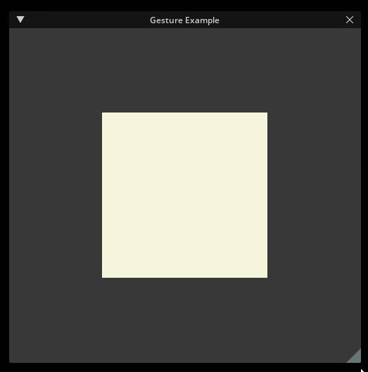


## Step 5.2: Handling Multiple Shapes

Knowing that only one gesture can occur at a time, we will see what happens when adding a second shape on top.

In `window.py`, **add** the following code below where we created the first Rectangle:

```python
transform = sc.Transform(transform=sc.Matrix44.get_translation_matrix(0,0,-1))
with transform:
    sc.Rectangle(
        2,
        2,
        color=ui.color.olive,
        thickness=5,
        gestures=[
            Move(transform),
            sc.ClickGesture(lambda s: setcolor(s, ui.color.blue)),
            sc.DoubleClickGesture(lambda s: setcolor(s, ui.color.olive))
        ]
    )
```

After editing `window.py` should look like the following:

```python
import omni.ui as ui
from omni.ui import scene as sc
from functools import partial

proj = [0.5,0,0,0,0,0.5,0,0,0,0,2e-7,0,0,0,1,1]

class Move(sc.DragGesture):
    def __init__(self, transform: sc.Transform, **kwargs):
        super().__init__(**kwargs)
        self.__transform = transform

    def on_changed(self):
        translate = self.sender.gesture_payload.moved
        # Move transform to the direction mouse moved
        current = sc.Matrix44.get_translation_matrix(*translate)
        self.__transform.transform *= current

def setcolor(sender, color):
    sender.color = color

class GestureWindowExample(ui.Window):
    def __init__(self, title: str, **kwargs) -> None:
        super().__init__(title, **kwargs)
        self.frame.set_build_fn(self._build_fn)

    def _build_fn(self):
        with self.frame:
            with ui.VStack():
                scene_view = sc.SceneView(sc.CameraModel(proj, 1), aspect_ratio_policy=sc.AspectRatioPolicy.PRESERVE_ASPECT_FIT)
                with scene_view.scene:
                    transform = sc.Transform()
                    with transform:
                        sc.Rectangle(
                            2,
                            2,
                            color=ui.color.beige,
                            thickness=5,
                            gestures=[
                                Move(transform),
                                sc.ClickGesture(lambda s: setcolor(s, ui.color.red)),
                                sc.DoubleClickGesture(lambda s: setcolor(s, ui.color.beige))
                            ]
                        )
                    transform = sc.Transform(transform=sc.Matrix44.get_translation_matrix(0,0,-1))
                        sc.Rectangle(
                            2,
                            2,
                            color=ui.color.olive,
                            thickness=5,
                            gestures=[
                                Move(transform),
                                sc.ClickGesture(lambda s: setcolor(s, ui.color.blue)),
                                sc.DoubleClickGesture(lambda s: setcolor(s, ui.color.olive))
                            ]
                        )
```

The above code creates an olive Rectangle that is infront of the beige rectangle. 

**Save** `window.py` and go back to Omniverse. Try clicking, double clicking, or dragging the rectangles.

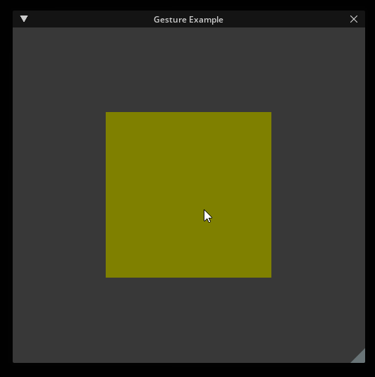

This demonstrates that the Gesture closer to the camera will fire. If all the shapes are under the same transform it will move all of them. However, since each rectangle is under their own transform it will move them seperately.

# Step 6: Gesture Manager

Gestures track incoming input events separately, but it’s normally necessary to let only one gesture be executed because it prevents user input from triggering more than one action at a time.

GestureManager controls the priority of gestures if they are processed at the same time. It prioritizes the desired gestures and prevents unintended gestures from being executed.

## Step 6.1: Create the Gesture Manager

To demonstrate the Gesture Manager we will give the beige priority through a Gesture Manager.

**Add** the following code block after `setcolor()`:

```python
class Manager(sc.GestureManager):
    def should_prevent(self, gesture: sc.AbstractGesture, preventer: sc.AbstractGesture) -> bool:
        if gesture.name != 'gesture_name' and preventer.state == sc.GestureState.BEGAN:
            return True
        
manager = Manager()

```

A Gesture Manager will inherit from `sc.GestureManager`. The Gesture Manager contains the function `should_prevent()` which can state whether or not the gesture should not run. If it returns `True` it will be prevented and if it returns `False` it will override the last gesture triggered.


## Step 6.2: Add the Gesture Manager to the Gestures

With a Gesture Manager defined we will need to pass it to the Gestures. To also avoid the olive rectangle's gestures from always being prevented a name will be assigned to the gestures as well.

**Update** the Gestures for the beige rectangle by passing in the following parameters:

```python
Move(transform, manager=manager, name="gesture_name"),
sc.ClickGesture(lambda s: setcolor(s, ui.color.red), manager=manager, name="gesture_name"),
sc.DoubleClickGesture(lambda s: setcolor(s, ui.color.beige),  manager=manager, name="gesture_name")
```

After editing `window.py` should look like the following:

```python
import omni.ui as ui
from omni.ui import scene as sc
from functools import partial

proj = [0.5,0,0,0,0,0.5,0,0,0,0,2e-7,0,0,0,1,1]

class Move(sc.DragGesture):
    def __init__(self, transform: sc.Transform, **kwargs):
        super().__init__(**kwargs)
        self.__transform = transform

    def on_changed(self):
        translate = self.sender.gesture_payload.moved
        # Move transform to the direction mouse moved
        current = sc.Matrix44.get_translation_matrix(*translate)
        self.__transform.transform *= current

def setcolor(sender, color):
    sender.color = color

class Manager(sc.GestureManager):
    def should_prevent(self, gesture: sc.AbstractGesture, preventer: sc.AbstractGesture) -> bool:
        if gesture.name != 'gesture_name' and preventer.state == sc.GestureState.BEGAN:
            return True
        
manager = Manager()

class GestureWindowExample(ui.Window):
    def __init__(self, title: str, **kwargs) -> None:
        super().__init__(title, **kwargs)
        self.frame.set_build_fn(self._build_fn)

    def _build_fn(self):
        with self.frame:
            with ui.VStack():
                scene_view = sc.SceneView(sc.CameraModel(proj, 1), aspect_ratio_policy=sc.AspectRatioPolicy.PRESERVE_ASPECT_FIT)
                with scene_view.scene:
                    transform = sc.Transform()
                    with transform:
                        sc.Rectangle(
                            2,
                            2,
                            color=ui.color.beige,
                            thickness=5,
                            gestures=[
                                Move(transform, manager=manager, name="gesture_name"),
                                sc.ClickGesture(lambda s: setcolor(s, ui.color.red), manager=manager, name="gesture_name"),
                                sc.DoubleClickGesture(lambda s: setcolor(s, ui.color.beige),  manager=manager, name="gesture_name")
                            ]
                        )
                    transform = sc.Transform(transform=sc.Matrix44.get_translation_matrix(0,0,-1))
                        sc.Rectangle(
                            2,
                            2,
                            color=ui.color.olive,
                            thickness=5,
                            gestures=[
                                Move(transform),
                                sc.ClickGesture(lambda s: setcolor(s, ui.color.blue)),
                                sc.DoubleClickGesture(lambda s: setcolor(s, ui.color.olive))
                            ]
                        )
```

**Save** `window.py` and go back to Omniverse. Now when you click and drag the beige rectangle will take priority over the olive rectangle. Even though the beige rectangle is behind the olive rectangle with the Gesture Manager we prevent the olive rectangle's gestures and prioritize the beige rectangle.

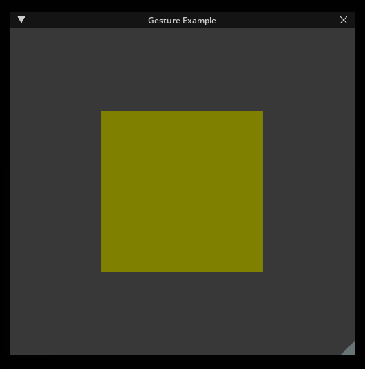

# Step 7: Simple Scene Manipulator 

Knowing how gestures work we can apply it to create a simple scene manipulator.

## Step 7.1: Create a new Extension

1. **Follow** the same steps from [Step 1](#step-1-create-an-extension)
2. Similar to [Step 2](#step-2-create-omniui-window), **create** a new file called `line.py`.

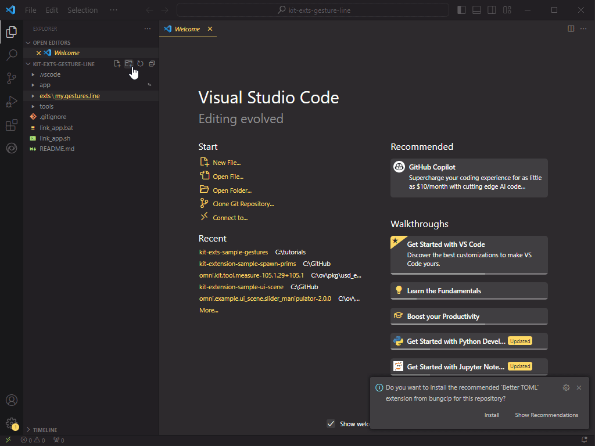

## Step 7.2: Create the Line Manipulator

In `line.py` **add** the following code and **save** the file:

```python
# line.py
import omni.ui as ui
from omni.ui import scene as sc

class LineManipulator(sc.Manipulator):
    def __init__(self, desc: dict, **kwargs) -> None:
        super().__init__(**kwargs)
    
    def on_build(self) -> None:
        transform = sc.Transform()
        with transform:
            sc.Line(
                [-50, 0, 0],
                [50, 0, 0],
                color = ui.color.beige,
                thickness=10
            )
```

**Open** `extension.py` and **replace** the code with the following:


```python
# extension.py
import omni.ext
from omni.kit.viewport.registry import RegisterScene
from .line import LineManipulator

# Any class derived from `omni.ext.IExt` in top level module (defined in `python.modules` of `extension.toml`) will be
# instantiated when extension gets enabled and `on_startup(ext_id)` will be called. Later when extension gets disabled
# on_shutdown() is called.
class OmniExampleGestureExtension(omni.ext.IExt):
    # ext_id is current extension id. It can be used with extension manager to query additional information, like where
    # this extension is located on filesystem.
    def on_startup(self, ext_id):
        print("[omni.example.gesture] omni example gesture startup")
        self._line = RegisterScene(LineManipulator, "Line Gesture")

    def on_shutdown(self):
        print("[omni.example.gesture] omni example gesture shutdown")
        self._line = None
```

**Save** `extension.py` and go back to Omniverse. You should see a beige line in the scene at the origin(0,0,0).

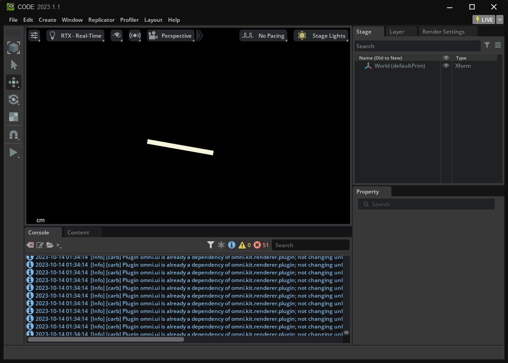

Notice that to add the Scene Manipulator is similar to how we create Rectangles in a Window frame. The difference is we registered it to the Viewport using `RegisterScene`.

# Step 7.3: Add a Gesture to the Line

1. Similiar to `window.py` **add** the following code to `line.py`:
```python
class Move(sc.DragGesture):
    def __init__(self, transform: sc.Transform, **kwargs):
        super().__init__(**kwargs)
        self.__transform = transform

    def on_changed(self):
        translate = self.sender.gesture_payload.moved
        # Move transform to the direction mouse moved
        current = sc.Matrix44.get_translation_matrix(*translate)
        self.__transform.transform *= current
```
2. **Pass** the parameter `gesture=Move(transform)` into `sc.Line()`.

After editing `window.py` should look like the following:

```python
# line.py
import omni.ui as ui
from omni.ui import scene as sc
class Move(sc.DragGesture):
    def __init__(self, transform: sc.Transform, **kwargs):
        super().__init__(**kwargs)
        self.__transform = transform

    def on_changed(self):
        translate = self.sender.gesture_payload.moved
        # Move transform to the direction mouse moved
        current = sc.Matrix44.get_translation_matrix(*translate)
        self.__transform.transform *= current

class LineManipulator(sc.Manipulator):
    def __init__(self, desc: dict, **kwargs) -> None:
        super().__init__(**kwargs)
    
    def on_build(self) -> None:
        transform = sc.Transform()
        with transform:
            sc.Line(
                [-50, 0, 0],
                [50, 0, 0],
                color = ui.color.beige,
                thickness=10,
                gesture=Move(transform)
            )
```

**Save** `line.py` and go back to Omniverse. When trying to drag the Line the Selection Gesture occurs instead. We can prevent this gesture using a Gesture Manager.

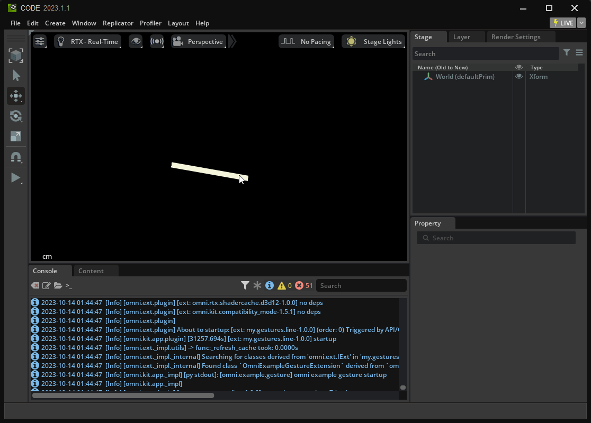

## Step 7.4: Add a Gesture Manager

The Gesture Manager works the same way when added in `window.py`. However, this time we will specify which gesture to prevent.

1. **Add** the following code after the imports:
```python
class Manager(sc.GestureManager):
    def should_prevent(self, gesture: sc.AbstractGesture, preventer: sc.AbstractGesture) -> bool:
        if gesture.name == "SelectionDrag" and preventer.state == sc.GestureState.BEGAN:
            return True

manager=Manager()
```

Since we want to prevent the `SelectionDrag` gesture we check to see if the gesture name is "SelectionDrag".

2. Inside `Line()`, **locate** `Move()` and **add** the argument `manager=manager` into `Move()`.

After editing `window.py` should look like the following:

```python
# line.py
import omni.ui as ui
from omni.ui import scene as sc

class Manager(sc.GestureManager):
    def should_prevent(self, gesture: sc.AbstractGesture, preventer: sc.AbstractGesture) -> bool:
        if gesture.name == "SelectionDrag" and preventer.state == sc.GestureState.BEGAN:
            return True

manager=Manager()

class Move(sc.DragGesture):
    def __init__(self, transform: sc.Transform, **kwargs):
        super().__init__(**kwargs)
        self.__transform = transform

    def on_changed(self):
        translate = self.sender.gesture_payload.moved
        # Move transform to the direction mouse moved
        current = sc.Matrix44.get_translation_matrix(*translate)
        self.__transform.transform *= current

class LineManipulator(sc.Manipulator):
    def __init__(self, desc: dict, **kwargs) -> None:
        super().__init__(**kwargs)
    
    def on_build(self) -> None:
        transform = sc.Transform()
        with transform:
            sc.Line(
                [-50, 0, 0],
                [50, 0, 0],
                color = ui.color.beige,
                thickness=10,
                gesture=Move(transform, manager=manager)
            )
```

**Save** `line.py` and go back to Omniverse. Now we can freely drag the line in the viewport.

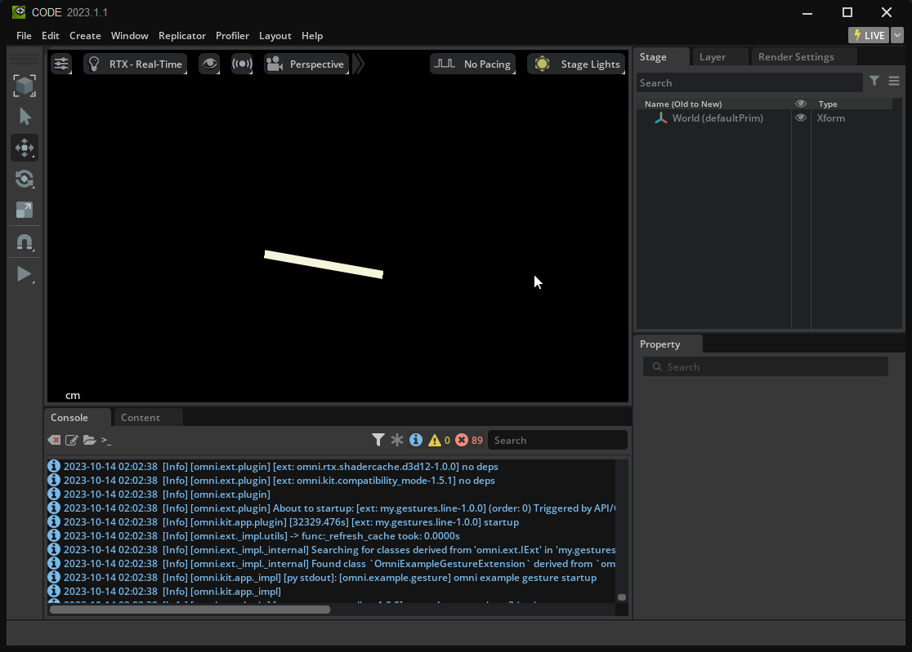
