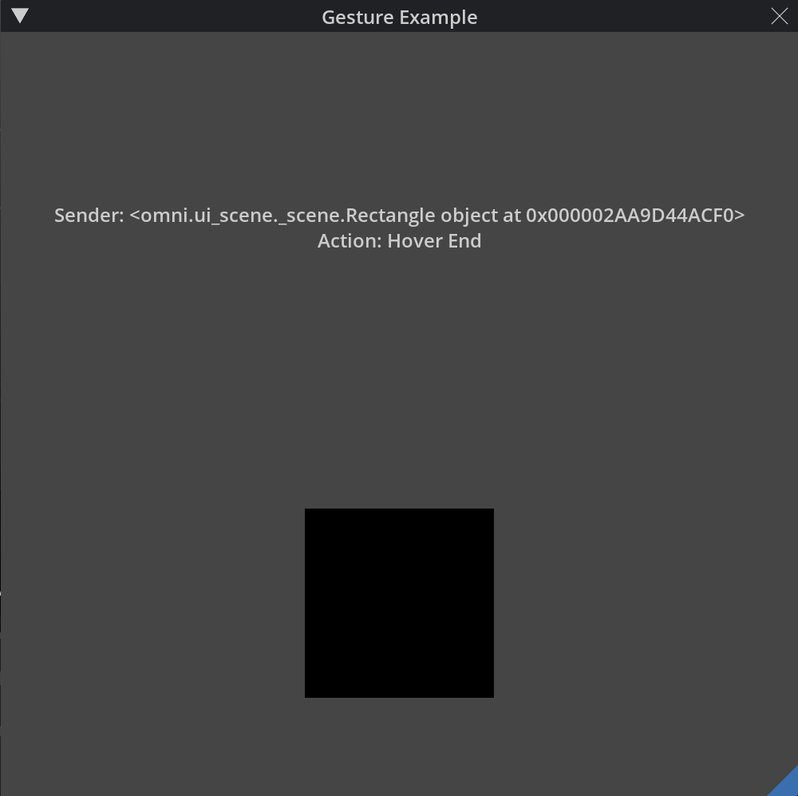

# Gestures Window (omni.example.gesture_window) 

​
## Overview

This Extension displays the a Window with two Rectangles that can be interacted with by hovering, clicking, and dragging.

See [Adding the Extension](../../../README.md#adding-this-extension) on how to add the extension to your project.
​
## [Tutorial](../../docs/tutorial.md)
This extension sample also includes a step-by-step tutorial to accelerate your growth as you learn to build your own Omniverse Kit extensions. 

Learn how to create a scene view within an omni.ui.Window element and how to apply gestures to items in the scene view. 

​[Get started with the tutorial here.](../../docs/tutorial.md)

## Usage

Once the extension is enabled in the *Extension Manager*, you should see a similar window in the to the image before [Overview section](#overview).

There is text refering to which object is recieving the gestures as well as the action. The actions that display are `Hover Changed` and `Hover Ended` where, `Hover Changed` refers to the change in location of the mouse on the object and `Hover Ended` refers to when the mouse has exitted the objects bounds. When the mouse first enters the object or `Hover Began`, the color of the Rectangles will turn black.

Both Rectangles can be dragged in the scene by clicking and dragging them. This utilitzing the `omni.ui.scene.DragGesture` functionality. 

You can click on each Rectangle to change the color (red and blue) or double click to change to their original colors (beige and olive).
​